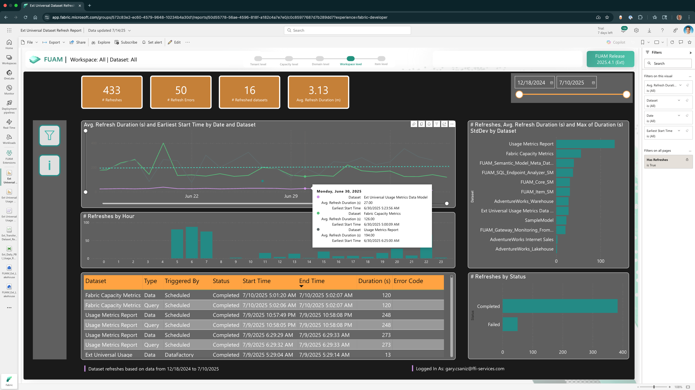
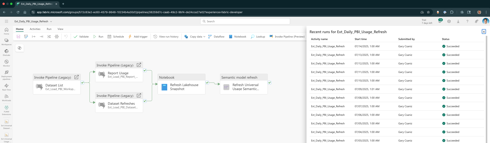
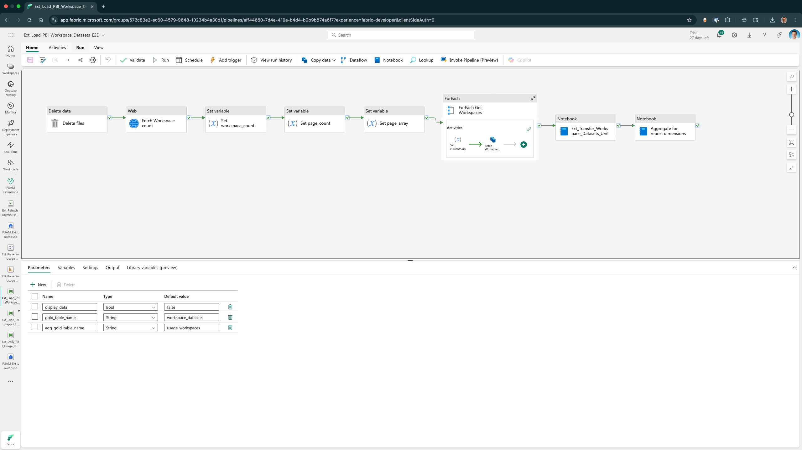
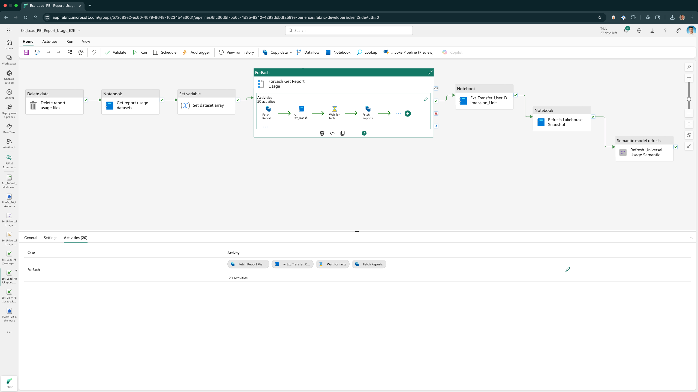
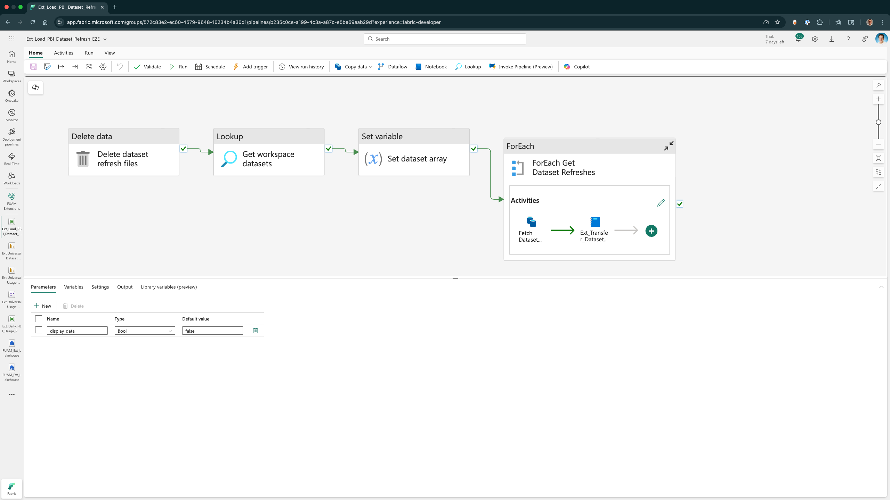
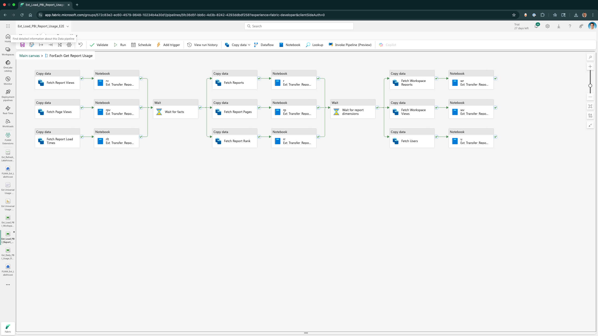

# Microsoft Fabric Universal Usage Metrics (UUM)

A robust data model and data engineering project designed to solve a key reporting challenge in Microsoft Fabric: the lack of a unified view for report usage metrics. By addressing this gap, the solution provides a centralized analytics platform that streamlines data visibility for decision-makers. UUM provides insights that can help drive adoption and improvements in your Power BI reports, providing measures that answer questions like:
- Who is viewing my report, how often, and from web or mobile?
- What are the most (and least) popular pages, and is usage trending up or down?
- Is the performance of my report good or bad?

**Fabric Universal Usage Metrics -- Report Usage Across all Workspaces**

> 🚨 **NEW DATASET REFRESH**: This feature was added in July 2025.

UUM has just released a new version that adds the same tenant-wide scope used in report usage metrics now to dataset refreshes. In addition to Power BI reports, new UUM measures add insights to Microsoft Fabric semantic model (dataset) refreshes that answer questions like:
- What is the reliability of refresh operations by type, workspace, and time? 
Why it matters: 
Observability and pipeline reliability are top priorities in modern data engineering. Monitoring refresh success rate, error frequency, and runtime anomalies helps prevent broken dashboards and trust erosion.
- Are there inefficient refresh operations that take longer than expected or retry too often? 
Why it matters: 
With more complex models (especially with DirectLake or composite models), refresh times may degrade. Identifying slow-running or frequently retried refreshes helps optimize backend model logic and scheduling.
- How are refresh loads distributed over the calendar and time slots? 
Why it matters: 
With Microsoft Fabric and large models, capacity planning and refresh scheduling can cause contention. A trend analysis helps rebalance schedules or switch models from ViaApi to DirectLake where beneficial.

**Fabric Universal Usage Metrics -- Semantic Model Refreshes Across all Workspaces**

## **Business Problem**
Microsoft Fabric currently lacks a built-in, **comprehensive usage metrics dashboard** that consolidates all report interactions across workspaces. Users must manually piece together usage insights, making it difficult to track engagement patterns, optimize resource allocation, and measure adoption effectively. The Universal Usage Metrics (UUM) application bridges this gap by creating a **single-pane-of-glass solution** for monitoring report usage. With the new version released in July 2025, the dataset refresh analytics feature extends the capabilities of UUM by providing deeper operational visibility and enabling end-to-end monitoring across the report lifecycle.

## **New Feature Benefits - July 2025 - Dataset Refreshes**

🔍 1. Completes the Usage + Refresh Picture
While UUM captures report interaction patterns (views, users, frequency), dataset refresh analytics adds critical insights into data readiness and reliability — helping teams correlate report usage with the freshness of the underlying data.
📌 Example: A report with low usage might be due to refresh failures or stale data. Now you can spot that instantly.

⸻

⚙️ 2. Adds Operational Intelligence
Dataset refresh logs introduce metrics such as:
- Refresh duration trends
- Failure types and frequency
- Refresh start/end timestamps
- Attempt-level diagnostics (e.g., API-triggered vs. Direct Lake refresh)

These can be used to:
- Detect slow or failing refreshes
- Identify bottlenecks in data pipelines
- Alert when critical datasets aren’t refreshed on schedule

⸻

📊 3. Enables SLA and Adoption Correlation
You can now:
- Measure SLA compliance: How often are refreshes completed within expected windows?
- Tie freshness to engagement: Do reports with fresher data see higher usage?
- Optimize scheduling: Align refresh frequency with actual user access patterns.

⸻

🔄 4. Supports Root Cause Analysis
If a dashboard isn’t being used:
- UUM shows the who/what/when of report usage.
- Refresh analytics reveals the why (e.g., refresh failures, long delays, stale data).

⸻

📡 5. Cross-Workspace Governance
Just like UUM aggregates usage across all workspaces, refresh analytics can be structured to:
- Centralize logs from multiple workspaces
- Surface global health indicators of the platform
- Automate alerting and reporting for admins or owners

✅ **Combined Value Proposition**

| **UUM + Refresh Analytics =**               | **Benefit**                                  |
|--------------------------------------------|-----------------------------------------------|
| Report usage + data pipeline performance    | Holistic analytics health monitoring          |
| Adoption + freshness linkage                | Improved user trust and engagement            |
| Operational telemetry + user patterns       | Smarter capacity and refresh scheduling       |
| Failure analysis + usage gaps               | Targeted troubleshooting                      |

## **UUM Approach**
UUM is built on top of the [Fabric Unified Admin Monitoring](https://github.com/microsoft/fabric-toolbox/tree/main/monitoring/fabric-unified-admin-monitoring) (short: FUAM) solution, which provides a holistic monitoring capability for Microsoft Fabric. Extending FUAM with UUM offers several advantages in terms of **efficiency, scalability, and governance**.

### **Key Advantages**
1. **Accelerated Development**  
   - FUAM provides a **pre-built framework** for monitoring **tenant-wide activities**, reducing the need to develop core functionalities from scratch.  
   - Saves time by leveraging **existing pipelines, Notebooks, and semantic models**.

2. **Comprehensive Monitoring Capabilities**  
   - FUAM already integrates **tenant settings, workspace activities, capacity metrics, and refreshable datasets**.  
   - Your solution can **extend** these capabilities to **report usage metrics** without reinventing the wheel.

3. **Optimized Data Storage & Query Performance**  
   - FUAM stores data in **Delta Parquet format**, enabling **efficient querying via Power BI Direct Lake or Lakehouse SQL Endpoint**.  
   - Your **Star Schema approach** aligns well with this structure, ensuring **fast aggregations and drill-down analysis**.

4. **Modular & Extensible Architecture**  
   - FUAM is designed with a **modular structure**, allowing you to **add custom monitoring modules**.  
   - You can **integrate your usage metrics model** seamlessly while maintaining **data integrity**.

5. **Secure & Scalable API Integration**  
   - FUAM leverages **Fabric pipelines and Notebooks** for **data extraction and transformation**.  
   - Your **service principal authentication setup** ensures **secure API calls** while maintaining **scalability**.

6. **Community-Driven Enhancements**  
   - FUAM is **actively developed** within the **Fabric Toolbox**, meaning you benefit from **ongoing improvements and contributions**.  
   - You can **collaborate with the community** to refine your solution.

### **How the UUM Solution Enhances FUAM**
- **Bridges the gap** by adding **report usage metrics** to FUAM’s existing monitoring framework.  
- **Improves governance** by providing **tenant-wide visibility** into report adoption and engagement.  
- **Optimizes performance** by leveraging **incremental data loads and partitioning strategies**.

By building on FUAM, UUM **maximizes efficiency** while ensuring **a solution that remains scalable and aligned with Microsoft Fabric’s evolving ecosystem**.

## **UUM Design: Star Schema Methodology**
UUM implements the **Star Schema modeling approach**, which is highly effective for analytics applications. Some key benefits of this methodology include:
- **Optimized Query Performance** – The **denormalized structure** reduces complex joins, ensuring fast data retrieval.
- **Flexible & Scalable Design** – Fact and dimension tables create a structured model that allows for easy expansion when new data sources or attributes are needed.
- **Simplified Reporting & Analysis** – End-users can easily query data for trends, aggregations, and drill-down analyses without complex transformations.
- **Efficient Data Storage** – Helps maintain a **balance between granularity and performance** by optimizing **indexing strategies**.

**Fabric Universal Usage Metrics -- Data Model Design**

## **Tools Used**
The UUM solution is powered by **Microsoft Fabric** and includes **key technologies** such as:
- **Lakehouse Architecture** – Ensuring scalable, high-performance storage with structured and semi-structured data.
- **Power BI** – Delivering interactive dashboards with **DAX measures** for insightful visualizations.
- **Dataflows & Pipelines** – **Automating ETL processes** to ingest, transform, and load usage metrics dynamically.
- **Azure Key Vault** – Securing credentials to manage API authentication seamlessly.
- **Notebooks (PySpark & SQL)** – Enabling **custom data transformation** and fine-tuned query logic for **dynamic URL construction** and metadata inspection.

## **Ensuring Data Integrity & Performance Optimization**
- **Data Validation & Quality Checks** – Implements rule-based checks to ensure consistency across reports.
- **Service Principal Authentication** – Secured connections to API endpoints, preventing unauthorized data access.
- **Partitioning Strategies** – Reduced query latency by **partitioning usage data**, ensuring scalable retrieval.
- **Incremental Data Loads** – Minimized processing time 🚀 by **only updating new records** instead of full dataset refreshes.
- **Metadata Inspection & Dynamic Querying** – Leverags **Fabric pipeline expressions** to dynamically construct API requests, ensuring **efficient data retrieval**.

## **UUM Architecture: Data Flows**
UUM leverages the [Microsoft Usage Metrics Report](https://learn.microsoft.com/en-us/power-bi/collaborate-share/service-modern-usage-metrics) semantic model that is created by the service in each workspace when the `View usage metrics report` function on the pop-up context menu for any report artifact is selected. The model contains usage data for the last 30 days, and Power BI then refreshes this semantic model daily. UUM provides several advantages over the default solution from Microsoft:
- A **data persistence framework** implented using a **Microsoft Fabric Lakehouse** stores usage statistics for years, not days, allowing for deeper analysis.
- Enables integration with with the organization's HR system, which adds user-friendly names (not IDs), business areas, departments, job roles and other dimensions to filter and analyze reporting trends.
- Improved branding and user experience, supporting multiple usage reports in a single interface, across multiple workspaces.

Implementation of the framework starts with a **Microsoft Fabric Data pipeline** that is run as a daily scheduled process to perform the end-to-end data engineering required to ingest new data, tranform to the standard model framework, merge into the historical persistentance layer (data lakehouse), and refresh the semantic model to automatically keep all reports and dashboards as up-to-date as possible.

**Fabric Universal Usage Metrics -- End-to-End Processing**

The first **Microsoft Fabric Data pipeline** uses the API to get the complete catalog of Usage Metric Report semantic model IDs, across all workspaces in the entire tenant, then storing them in the Lakehouse.

**Fabric Universal Usage Metrics -- Workspace Datasets Flow**

These IDs are the input to two other parallel **Microsoft Fabric Data pipelines** in the end-to-end processing that load the report usage and dataset refresh data into the Lakehouse using an **upsert approach** (inserting new records and updating existing ones) to efficiently synchronize between the source Microsoft default semantic model and the UUM Lakehouse targets.

**Fabric Universal Usage Metrics -- Report Usage Flow**

**Fabric Universal Usage Metrics -- Dataset Refreshes Flow**

These pipelines optimize performance by looping through the input and creating multiple parallel processing threads to get the lastest facts and dimensions. 

**Fabric Universal Usage Metrics -- Report Usage Flow Parallel Processing**

The final two activities in the end-to-end processing refresh the *GOLD LAYER* **Microsoft Fabric Lakehouse** using a Notebook and **Power BI Semantic Model** using the Fabric API, thereby keeping the entire visualization layer up-to-date with the best information available.

## **Conclusion**
The **Universal Usage Metrics application** is a forward-thinking solution that enhances Microsoft Fabric’s analytics capabilities. By **leveraging a structured Star Schema model**, optimizing **query efficiency**, and ensuring **secure API configurations**, it not only **solves a critical business problem** but also **establishes a scalable framework** for data governance and performance monitoring.
