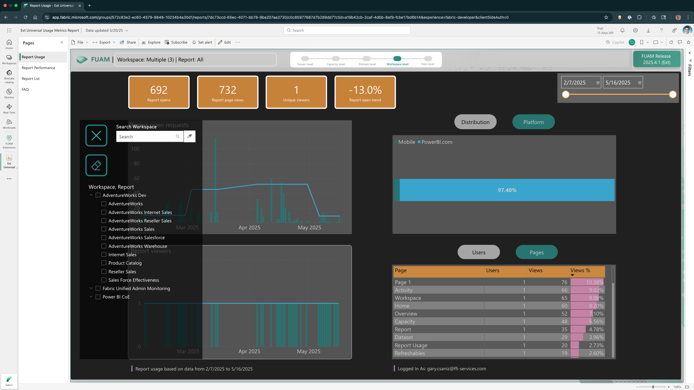
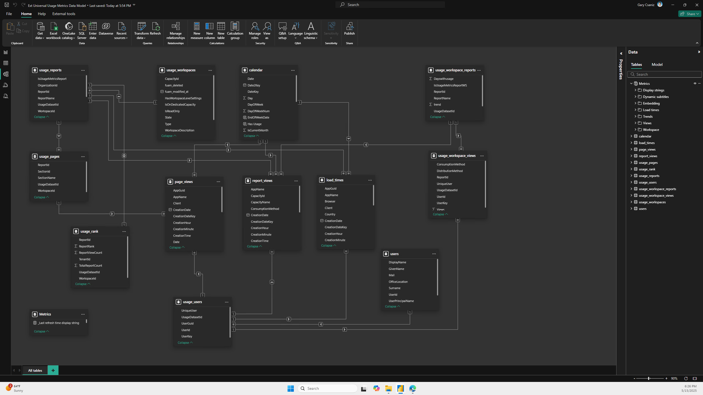

# Microsoft Fabric Universal Usage Metrics

A robust data model and data engineering project designed to solve a key reporting challenge in Microsoft Fabric: the lack of a unified view for report usage metrics. By addressing this gap, the solution provides a centralized analytics platform that streamlines data visibility for decision-makers.

**Fabric Universal Usage Metrics -- Report Usage Across all Workspaces**

## **Business Problem**
Microsoft Fabric currently lacks a built-in, **comprehensive usage metrics dashboard** that consolidates all report interactions across workspaces. Users must manually piece together usage insights, making it difficult to track engagement patterns, optimize resource allocation, and measure adoption effectively. The Universal Usage Metrics (UUM) application bridges this gap by creating a **single-pane-of-glass solution** for monitoring report usage.

## **UUM Approach**
UUM is built on top of the [Fabric Unified Admin Monitoring](https://github.com/microsoft/fabric-toolbox/tree/main/monitoring/fabric-unified-admin-monitoring) (short: FUAM) solution, which provides a holistic monitoring capability for Microsoft Fabric. Extending FUAM with UUM offers several advantages in terms of **efficiency, scalability, and governance**.

### **Key Advantages**
1. **Accelerated Development**  
   - FUAM provides a **pre-built framework** for monitoring **tenant-wide activities**, reducing the need to develop core functionalities from scratch.  
   - Saves time by leveraging **existing pipelines, Notebooks, and semantic models**.

2. **Comprehensive Monitoring Capabilities**  
   - FUAM already integrates **tenant settings, workspace activities, capacity metrics, and refreshable datasets**.  
   - Your solution can **extend** these capabilities to **report usage metrics** without reinventing the wheel.

3. **Optimized Data Storage & Query Performance**  
   - FUAM stores data in **Delta Parquet format**, enabling **efficient querying via Power BI Direct Lake or Lakehouse SQL Endpoint**.  
   - Your **Star Schema approach** aligns well with this structure, ensuring **fast aggregations and drill-down analysis**.

4. **Modular & Extensible Architecture**  
   - FUAM is designed with a **modular structure**, allowing you to **add custom monitoring modules**.  
   - You can **integrate your usage metrics model** seamlessly while maintaining **data integrity**.

5. **Secure & Scalable API Integration**  
   - FUAM leverages **Fabric pipelines and Notebooks** for **data extraction and transformation**.  
   - Your **service principal authentication setup** ensures **secure API calls** while maintaining **scalability**.

6. **Community-Driven Enhancements**  
   - FUAM is **actively developed** within the **Fabric Toolbox**, meaning you benefit from **ongoing improvements and contributions**.  
   - You can **collaborate with the community** to refine your solution.

### **How the UUM Solution Enhances FUAM**
- **Bridges the gap** by adding **report usage metrics** to FUAM’s existing monitoring framework.  
- **Improves governance** by providing **tenant-wide visibility** into report adoption and engagement.  
- **Optimizes performance** by leveraging **incremental data loads and partitioning strategies**.

By building on FUAM, UUM **maximizes efficiency** while ensuring **a solution that remains scalable and aligned with Microsoft Fabric’s evolving ecosystem**.

## **UUM Design: Star Schema Methodology**
UUM implements the **Star Schema modeling approach**, which is highly effective for analytics applications. Some key benefits of this methodology include:
- **Optimized Query Performance** – The **denormalized structure** reduces complex joins, ensuring fast data retrieval.
- **Flexible & Scalable Design** – Fact and dimension tables create a structured model that allows for easy expansion when new data sources or attributes are needed.
- **Simplified Reporting & Analysis** – End-users can easily query data for trends, aggregations, and drill-down analyses without complex transformations.
- **Efficient Data Storage** – Helps maintain a **balance between granularity and performance** by optimizing **indexing strategies**.

**Fabric Universal Usage Metrics -- Data Model Design**

## **Tools Used**
The UUM solution is powered by **Microsoft Fabric** and includes **key technologies** such as:
- **Lakehouse Architecture** – Ensuring scalable, high-performance storage with structured and semi-structured data.
- **Power BI** – Delivering interactive dashboards with **DAX measures** for insightful visualizations.
- **Dataflows & Pipelines** – **Automating ETL processes** to ingest, transform, and load usage metrics dynamically.
- **Azure Key Vault** – Securing credentials to manage API authentication seamlessly.
- **Notebooks (PySpark & SQL)** – Enabling **custom data transformation** and fine-tuned query logic for **dynamic URL construction** and metadata inspection.

## **Ensuring Data Integrity & Performance Optimization**
- **Data Validation & Quality Checks** – Implements rule-based checks to ensure consistency across reports.
- **Service Principal Authentication** – Secured connections to API endpoints, preventing unauthorized data access.
- **Partitioning Strategies** – Reduced query latency by **partitioning usage data**, ensuring scalable retrieval.
- **Incremental Data Loads** – Minimized processing time 🚀 by **only updating new records** instead of full dataset refreshes.
- **Metadata Inspection & Dynamic Querying** – Leverags **Fabric pipeline expressions** to dynamically construct API requests, ensuring **efficient data retrieval**.

## **Conclusion**
The **Universal Usage Metrics application** is a forward-thinking solution that enhances Microsoft Fabric’s analytics capabilities. By **leveraging a structured Star Schema model**, optimizing **query efficiency**, and ensuring **secure API configurations**, it not only **solves a critical business problem** but also **establishes a scalable framework** for data governance and performance monitoring.
